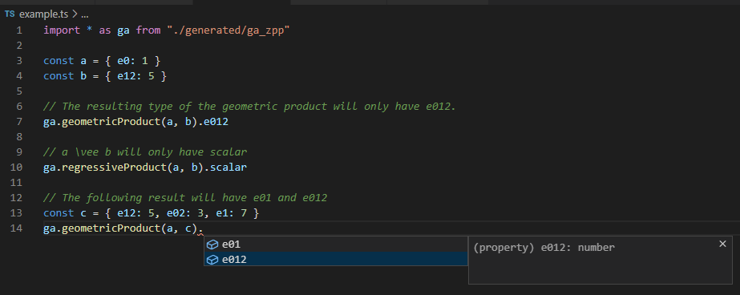

# Typed Geometric Algebra
TypeScript Geometric Algebra implementations with proper typing. Autogenerated using Python and TFGA.

# Structure
- `generated/`: TypeScript implementations for Geometric Algebras with different signatures (eg. signature `[-1, 0, 1, 1]` is `ga_mzpp.ts`)
- `tsgen.ipynb`: Jupyter notebook that generates the TypeScript implementations
- `example.ts`: The example from the above screenshot

# Generating new algebras
To generate new algebras running the notebook is required. The notebook requires installing [TFGA](https://github.com/RobinKa/tfga). The last cell contains the
code to generate the TypeScript files. Here arbitrary signatures can be defined to be generated.